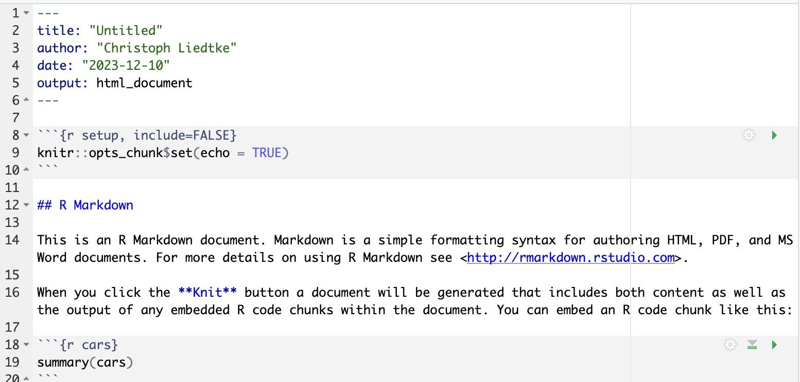

```{r setup, include=FALSE}
knitr::opts_chunk$set(echo = TRUE,
                      eval = TRUE,
                      message=FALSE,
                      error=FALSE)
knitr::opts_knit$set(root.dir = '../')
library(webexercises)
```

```{r eval=TRUE}
# set working directory
setwd("~/Documents/git_projects/RforBiologists_UDSM/")

# install pacman if not already installed
if (!require("pacman")) install.packages("pacman")

# use pacman to load libraries
#pacman::p_load()

```

# The Notebook

So far, we have written code in a script file and this code was sent to the console for execution. Although we haven't gotten there yet, when you start plotting data, that's sent to another plotting window. This is quite limited, because the script files can get quite messy and your notes, code and output are all in separate places. If you want to share your analysis with someone, you would have to ask them to run your script. This is not very practical.

Enter the R notebook! This is a file that leverages markdown language to make more intuitive R code! Together this is called _R Markdown_ and appropriately, the file extension is _.rmd_.



Together with Rstudio, that can _visualize_, or preview the markdown code, this is starting to look a lot like a word document! This may feel more familiar to some of you and will help to get you started! Infact all of this class material was created with Rmarkdown!
  
Let's spend some time exploring the notebook.

* Source vs. visual view  
* YAML header
* Markdown text
* Code chunks
* Chunk and preview settings
* Knitting to HTML

# RMarkdown templates and cheat sheet

Creating and sharing your notebooks is quite flexible. We will not go into much details on this subject, but I will leave you here an important resource. This [cheat sheet](https://rstudio.github.io/cheatsheets/html/rmarkdown.html) should tell you all you need to know to get going!


