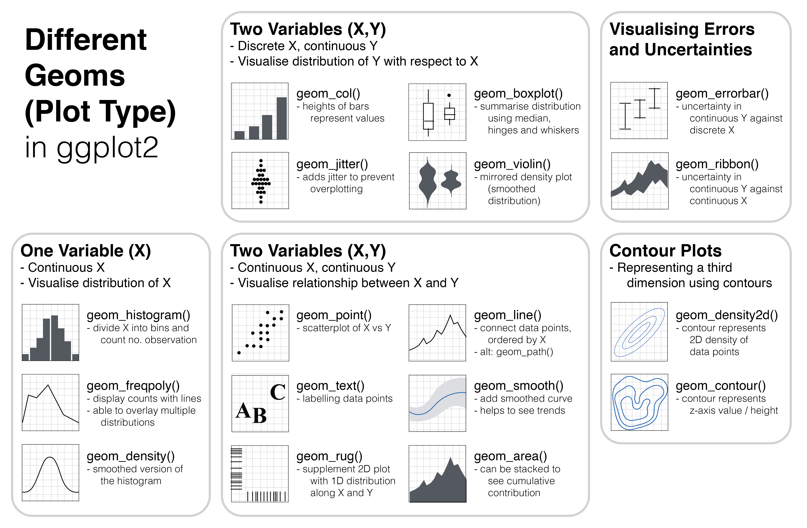
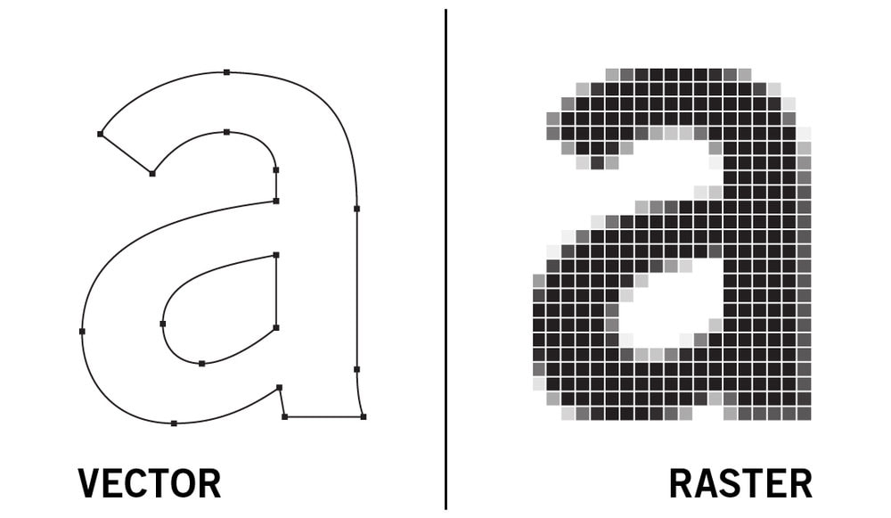

```{r setup, include=FALSE}
knitr::opts_chunk$set(echo = TRUE,
                      eval = TRUE,
                      message=FALSE,
                      error=FALSE)
#knitr::opts_knit$set(root.dir = '../')
```

# Visualizing data with ggplot2

R comes shipped with simple plotting functions. We will not touch on these today, instead we will go straight to ggplot2, which forms part of the tidyverse and is a much more powerful and scale-able grammar for data visualization.

The intuitive think about ggplot is that everything is done with "layers". For any plot, you need at least these components/layers:

-   data - the information to visualize
-   mapping - the description of how the data’s variables are mapped to aesthetic attributes

And the following, optional components:

-   scales - map values in the data space to values in the aesthetic space. This includes the use of colour, shape or size.

-   coords - coordinate system, describes how data coordinates are mapped to the plane of the graphic. It also provides axes and gridlines to help read the graph. We normally use the Cartesian coordinate system, but a number of others are available, including polar coordinates and map projections.

-   facets - pecifies how to break up and display subsets of data as small multiples this is also known as conditioning or latticing/trellising.

-   theme - controls the finer points of display, like the font size and background colour. These allow changing whole themes, or single components of themes.

## 1. Prepping your work station

As always, before we start any project, we have to set the working directory, load any libraries we will need and of course import the data we will use. For this exercise we will use one of the many example datasets that come shipped with R or the tidyverse.

```{r}
# set working directoy
setwd("~/Documents/git_projects/RforBiologists_UDSM/")

# load library
library("tidyverse")

# load data
iris<-iris %>% as_tibble()
iris
```

## 2. A clean slate

The first step for any plot is to pass the data to the plot. This is the first essential ingredient. If we add no other information, we would just great an empty plot.

```{r}
iris %>%
  ggplot()
```

## 3. Adding geometric elements

The second essential ingredient is to *map* the components of the data. We do this using *aesthetics*.

```{r}
iris %>%
  ggplot(mapping=aes(x=Sepal.Length, y=Sepal.Width))
```

We have now defined the axes and the extent of the data. The next step now is to add layers. The most important layer is to specify how that data should be visualized. This is where **geometric objects** or *geoms* come in. These are usually appropriately named and here is a link to a great [cheatsheet](https://rstudio.github.io/cheatsheets/html/data-visualization.html). For now, let's look at a simplified version:



[image source](https://ouyanglab.com/covid19dataviz/ggplot2.html)

Seeing as we have already defined 2 continuous variables, lets start with a scatter plot. Layers are added with `+`.

```{r}
iris  %>%
  ggplot(mapping=aes(x=Sepal.Length, y=Sepal.Width)) +
  geom_point()
```

*Note: ggplot with go ahead and plot any data it can, and warn you about data that it does not know how to deal with, e.g. NAs*

## 4. Colour, size and shapes

There are two main ways we can change the shapes of points and their colour. The first would be to add a single fixed colour and shape. The full list of these "aesthetics" can be looked up [here](https://ggplot2.tidyverse.org/articles/ggplot2-specs.html).

```{r}
iris  %>%
  ggplot(mapping=aes(x=Sepal.Length, y=Sepal.Width)) +
    geom_point(color="blue", shape="square", size=3)
```

However, the full power of shapes or colours is to distinguish between groups of data. Instead of defining these as fixed variables, we can include them as *mapping variables*. This time, we don't specify a specific shape or colour, but we assign variables to these components:

```{r}
iris  %>%
  ggplot(mapping=aes(x=Sepal.Length, y=Sepal.Width)) +
    geom_point(mapping=aes(color=Species))
```

## 4. Adding more layers

Next, we may want to manipulate the scale, the colour choices or any other aspect of the plot. The possibilities are quite extensive, and in my opinion, are best learned on the go. For now lets just look at some of them.

#### Scales

There are many scales. Start typing `scales_` and have a look at the options. For now, lets manually define the colours and change the axis ticks. Note that we are also going to touch on [hex colour codes](https://htmlcolorcodes.com/).

```{r}
iris  %>%
  ggplot(mapping=aes(x=Sepal.Length, y=Sepal.Width)) +
  geom_point(mapping=aes(color=Species)) +
  scale_colour_manual(values = c(setosa="skyblue1", versicolor="#c70039", virginica="#28b463")) +
  scale_x_continuous(n.breaks = 10) +
  scale_y_continuous(limits = c(1.5,5))
  
```

#### Titles, axes and legends

There are many ways that plots can be customized.. lets look at some of them:

```{r}
iris  %>%
  ggplot(mapping=aes(x=Sepal.Length, y=Sepal.Width)) +
  geom_point(mapping=aes(color=Species)) +
  scale_colour_manual(values = c(setosa="skyblue1", versicolor="#c70039", virginica="#28b463")) +
  scale_x_continuous(n.breaks = 10) +
  scale_y_continuous(limits = c(1.5,5)) +
  labs(x="Sepal Length (cm)", y="Sepal Width (cm)") +
  ggtitle("Iris Sepals") +
  theme(legend.position="bottom")
  
```

We could pretty much customize everything, but we can also leverage some *themes* that come shipped with ggplot2. Here is an illustration of these:


Lets try one of them:

```{r}
iris  %>%
  ggplot(mapping=aes(x=Sepal.Length, y=Sepal.Width)) +
  geom_point(mapping=aes(color=Species)) +
  scale_colour_manual(values = c(setosa="skyblue1", versicolor="#c70039", virginica="#28b463")) +
  scale_x_continuous(n.breaks = 10) +
  scale_y_continuous(limits = c(1.5,5)) +
  labs(x="Sepal Length (cm)", y="Sepal Width (cm)") +
  ggtitle("Iris Sepals") +
  theme_bw()
```

#### Regression lines

We can also add regression lines to our plots with relative ease. This is also a good time to demonstrate how mapping variables are inherited.

```{r}
# a single regression slope
iris  %>%
  ggplot(mapping=aes(x=Sepal.Length, y=Sepal.Width)) +
  geom_point(mapping=aes(color=Species)) +
  geom_smooth(method = "lm") +
  ggtitle("Iris Sepals with linear regressions") +
  theme_bw()

# multiple regression slopes
iris  %>%
  ggplot(mapping=aes(x=Sepal.Length, y=Sepal.Width, color=Species)) +
  geom_point() +
  geom_smooth(method = "lm", se=FALSE) +
  ggtitle("Iris Sepals with linear regressions") +
  theme_bw()
```

## 5. Faceting

Another very powerful method for plotting data is *faceting*. This refers to splitting related data across multiple plots. For example, with the iris data, we could plot each species across a different plotting area, because they share the same axes.

```{r}
iris  %>%
  ggplot(mapping=aes(x = Sepal.Length, y = Sepal.Width, color = Species)) +  # note, we have included the mapping variables here, not for the geom_point()
  geom_point() +
  facet_wrap( ~ Species, nrow = 1, scales = "fixed") + # play arund with the number of rows and the scales!
  theme_bw() +
  theme(legend.position = "none") # we don't need the legend anymore.
```

## 6. Different types of plots

So far, we have only looked at scatter plots, but by simply switching out the *geometry* we can change the type of plot we want.

```{r}
iris  %>%
  ggplot(mapping=aes(x = Species, y = Sepal.Width)) +  
  geom_boxplot() +
  ggtitle("Boxplot")
```

Or we can combine geometries

```{r}
iris  %>%
  ggplot(mapping=aes(x = Species, y = Sepal.Width)) +  
  geom_boxplot() +
  geom_jitter(width=0.1, color="lightblue")
```

or densities/ histogram:

```{r}
iris  %>%
  ggplot(mapping=aes(x = Sepal.Width, fill=Species)) +  
  geom_density(alpha=0.5) # try swapping this out for geom_histogram()
```

or bar plots on a summary statistic.

```{r}
## by calculating summary statistic first
iris %>%
  group_by(Species) %>%
  summarise(mean_width=mean(Sepal.Width)) %>%
  ggplot(aes(x=Species, y=mean_width)) +
  geom_bar(stat="identity")


# by using stat_summary()
iris %>%
  ggplot(aes(x=Species, y=Sepal.Width)) +
  stat_summary(fun.y="mean",geom="bar")


```

## 7. Exporting plots

Once you have your plot ready, you will want to export it. The easiest way to do this is to use the "Export" menu in the Plots window.

In almost all cases, your plots will be some form of vectorized graphic.



[image source](<https://blog.fileformat.com/image/raster-vs-vector-images-a-brief-comparison/>)

For this reason, it is almost always the better choice to export plots as PDFs that support vector graphics. This will insure no resolution is lost and it would give you the option to edit minor aspects post-plotting, in software such as [Adobe Illustrator](<https://www.adobe.com/products/illustrator.html>), or free alternatives like [figma](<https://www.figma.com/>) or [GIMP](<https://www.gimp.org/>).

# Sources

This tutorial borrowed code and ideas from the following sources:

<https://ggplot2-book.org/introduction>
