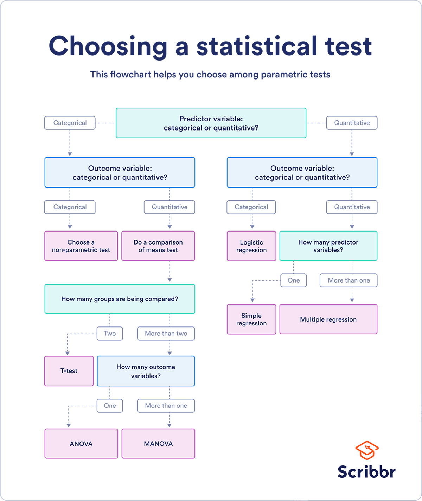

```{r setup, include=FALSE}
knitr::opts_chunk$set(echo = TRUE,
                      eval = TRUE,
                      message=FALSE,
                      error=FALSE)
#knitr::opts_knit$set(root.dir = '../')
```

# Statistics using R

R is first and foremost a programming language that was developed for statistics. As such, the possibilities for different types of data analysis are massive and continue to be developed. It would be impossible to impart a comprehensive tutorial on statistics in R in the limited time we have. The purpose of this section is therefore to introduce you to some common analyses and the typical syntax of running statistical models in R.

## 1. Formulating Generalized Linear Models.

Perhaps the most frequently used types of statistical models in biology are generalized linear models (GLMs). As a reminder, special cases of this would be linear regression models, ANOVAs or a Student's T-tests. The typical syntax for such a model is:

`glm( y ~ x, data, family)`

Lets try try this with the iris dataset

```{r}
# load data
iris<-iris

# run a general linear model with a gaussian family

mod1<-glm(Sepal.Length~Sepal.Width, data=iris, family="gaussian")

```

Lets look at the structure of the output of this model. This can be done in the "environment" window, or like so:

```{r}
str(mod1)
```

As this is generally a little overwhelming, R knows to spit out just the important information, or the information can be summarized:

```{r}
# call just the model
mod1
# summarize model:
summary(mod1)
```

This coefficients table should be more familiar to us. It is also worth pointing out that a GLM with a gaussian distribution is simply a linear regression model, and indeed, we can use a shortcut to run such a model:

```{r}
mod2<-lm(Sepal.Length~Sepal.Width, data=iris)
summary(mod2)
```

The results should be identical. What can we conclude from this model? Is it odd that the we get a negative regression coefficient (Be sure to also look at the R-squared!)

It is always a good idea to visualize this relationship as well. For this we will need to load the tidyverse again.

```{r}
library(tidyverse)

iris %>%
  ggplot(aes(x=Sepal.Width, y=Sepal.Length)) +
  geom_point()
```

To fit the regression model, we could use the canned functionality of `geom_smooth`.

```{r}
iris %>%
  ggplot(aes(x=Sepal.Width, y=Sepal.Length)) +
  geom_point() +
  geom_smooth(method="lm")
```

If we run more complicated models, it may be that we have to plot our own regression slopes. We can do this, because we know the y-intercept and the slope.

```{r}
# the coefficients we need:
coef(mod1)

# the abline geom:
iris %>%
  ggplot(aes(x=Sepal.Width, y=Sepal.Length)) +
  geom_point() +
  geom_abline(intercept=coef(mod1)[1], slope=coef(mod1)[2])
```

We already saw that the R-squared was very low. This means, the model is a poor fit. Why is this so miss-leading? This is missleading, because there is a strong species effect. What would the slopes look like if we ran models for individual species?

```{r}
iris %>%
  ggplot(aes(x=Sepal.Width, y=Sepal.Length, color=Species)) +
  geom_point()
```

We should therefore probably include species as another variable in our model, to build a *multiple regression* model.

```{r}
mod3<-lm(Sepal.Length~Sepal.Width+Species, data=iris)
summary(mod3)
```

We now see that the r-squared is greatly improved, that sepal width is positively correlated with sepal length and that the intercepts for each species is significantly different from each other.

```{r}
iris %>%
  ggplot(aes(x=Sepal.Width, y=Sepal.Length, color=Species)) +
  geom_point() +
  geom_smooth(method="lm")
```

This means that the Sepal length is likely significantly different between the two species (the y-intercept), but judging from the plot, the relationship of sepal width and length is the same between the species. We could test this by including an interaction effect:

```{r}
mod4<-lm(Sepal.Length~Sepal.Width*Species, data=iris)
summary(mod4)
```

We see that there is no significant interaction term, which we can interpret as all slopes being the same.

## 3. Choose the right test



[image source](https://www.scribbr.com/statistics/statistical-tests/)

but there's more:

-   machine learning (from LDA to random forest)

-   Bayesian statistics

## 4. Categorical predictors: T-test and ANOVA

## 5. Data exploration

-   ggally pair plots

-   high variable dimensions: PCA

## 6. Test assumptions

-   normality

-   heteroskedasticity

-   phylogenetic signal
