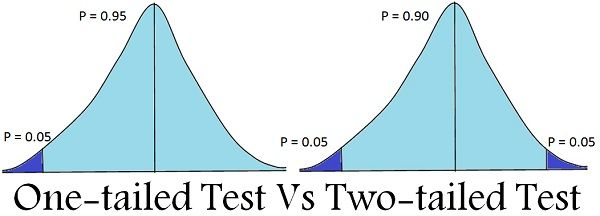

```{r setup, include=FALSE}
knitr::opts_chunk$set(echo = TRUE,
                      eval = TRUE,
                      message=FALSE,
                      error=FALSE)
```

# Statistics using R

R is first and foremost a programming language that was developed for statistics. As such, the possibilities for different types of data analysis are massive and continue to be developed. It would be impossible to impart a comprehensive tutorial on statistics in R in the limited time we have. The purpose of this section is therefore to introduce you to some common analyses and the typical syntax of running statistical models in R.

## 1. Formulating Generalized Linear Models

Perhaps the most frequently used types of statistical models in biology are generalized linear models (GLMs). As a reminder, special cases of this would be linear regression models, ANOVAs or a Student's T-tests. The typical syntax for such a model is:

`glm( y ~ x, data, family)`

Lets try try this with the iris dataset

```{r}
# load data
iris<-iris

# run a general linear model with a gaussian family

mod1<-glm(Sepal.Length~Sepal.Width, data=iris, family="gaussian")

```

Lets look at the structure of the output of this model. This can be done in the "environment" window, or like so:

```{r}
str(mod1)
```

As this is generally a little overwhelming, R knows to spit out just the important information, or the information can be summarized:

```{r}
# call just the model
mod1
# summarize model:
summary(mod1)
```

This coefficients table should be more familiar to us. It is also worth pointing out that a GLM with a gaussian distribution is simply a linear regression model, and indeed, we can use a shortcut to run such a model:

```{r}
mod2<-lm(Sepal.Length~Sepal.Width, data=iris)
summary(mod2)
```

The results should be identical. What can we conclude from this model? Is it odd that the we get a negative regression coefficient (Be sure to also look at the R-squared!)

It is always a good idea to visualize this relationship as well. For this we will need to load the tidyverse again.

```{r}
library(tidyverse)

iris %>%
  ggplot(aes(x=Sepal.Width, y=Sepal.Length)) +
  geom_point()
```

To fit the regression model, we could use the canned functionality of `geom_smooth`.

```{r}
iris %>%
  ggplot(aes(x=Sepal.Width, y=Sepal.Length)) +
  geom_point() +
  geom_smooth(method="lm")
```

If we run more complicated models, it may be that we have to plot our own regression slopes. We can do this, because we know the y-intercept and the slope.

```{r}
# the coefficients we need:
coef(mod1)

# the abline geom:
iris %>%
  ggplot(aes(x=Sepal.Width, y=Sepal.Length)) +
  geom_point() +
  geom_abline(intercept=coef(mod1)[1], slope=coef(mod1)[2])
```

We already saw that the R-squared was very low. This means, the model is a poor fit. Why is this so miss-leading? This is missleading, because there is a strong species effect. What would the slopes look like if we ran models for individual species?

```{r}
iris %>%
  ggplot(aes(x=Sepal.Width, y=Sepal.Length, color=Species)) +
  geom_point()
```

We should therefore probably include species as another variable in our model, to build a *multiple regression* model.

```{r}
mod3<-lm(Sepal.Length~Sepal.Width+Species, data=iris)
summary(mod3)
```

We now see that the r-squared is greatly improved, that sepal width is positively correlated with sepal length and that the intercepts for each species is significantly different from each other.

```{r}
iris %>%
  ggplot(aes(x=Sepal.Width, y=Sepal.Length, color=Species)) +
  geom_point() +
  geom_smooth(method="lm")
```

This means that the Sepal length is likely significantly different between the two species (the y-intercept), but judging from the plot, the relationship of sepal width and length is the same between the species. We could test this by including an interaction effect:

```{r}
mod4<-lm(Sepal.Length~Sepal.Width*Species, data=iris)
summary(mod4)
```

We see that there is no significant interaction term, which we can interpret as all slopes being the same.

## 3. Choose the right test


[image source](https://www.scribbr.com/statistics/statistical-tests/)

but there's more:

-   machine learning (from LDA to random forest)

-   Bayesian statistics

## 4. Categorical predictors: T-test and ANOVA

A very common problem in biology is to test the difference between the response of two or more groups is statistically significant or not. Essentially we are comparing within group and between group variances.


[image source](https://www.datanovia.com/en/lessons/anova-in-r/#check-assumptions)

For two groups, this would usually be achieved with a T-test, and for more than two groups, this could be achieved with an ANOVA. These are special cases of a GLM, and could be performed similarly to how we did above. However, because they are quite specific hypothesis tests, functions exist in R to execute them directly.

#### T-Test

The basic idea behind a T-Test is to use statistics to evaluate two contrary hypotheses:

-   H0: NULL hypothesis: The average is the same as the sample used
-   H1: True hypothesis: The average is different from the sample used

The T-test is commonly used with small sample sizes and normality (something we will address later). The sample could be a fixed value (one sample t-test) or you could be comparing means of two groups (a two sample t-test). Lets try a two sample T-test.

Lets test to see if Sepal Length is different between *I. versicolor* and *I. virginica*.

```{r}
# filter data to only two groups. We have to also remember to drop the factor levels!
iris2<-iris %>%
  filter(Species!="setosa") %>%
  mutate(Species=fct_drop(Species))

#
t.test(iris2$Sepal.Length~iris2$Species)
```

To be specific, this is a two-tailed t-test. This is the default.



Looking at the function's documentation, could you figure our how to run a one-tailed test?

#### ANOVA

In an ANOVA, the hypotheses are essentially the same, but the independent variable has more than two factor levels.

```{r}
aov1<-aov(iris$Sepal.Length~iris$Species)
aov1
# to get the test statistics, we have to summarize this model first:
summary(aov1)
```

You may also be interested in testing which groups exactly are different. This is achieved with a posthoc test.

```{r}
TukeyHSD(aov1)
```

An appropriate way to visualize these kinds of problems are with a boxplot.

```{r}
iris %>%
  ggplot(aes(x=Species, y=Sepal.Length)) +
  geom_boxplot()
```

## 5. Check assumptions

It is important to understand that as long as the syntax is correct and the data is formatted correctly, R will run any statistical test you ask it to. It is therefore up to you to understand the assumptions of the method you are applying. These will differ between tests, but for linear-regression type problems, like the ANOVA, there are generally three assumptions we should be aware of:

#### Normality

The data for each factor should be normally distributed. We could check this visually with a histogram or a density plot.

```{r}
# histogram
iris %>%
  ggplot(aes(x=Sepal.Length)) +
  geom_histogram(bins = 20) # refin the number of bins

# how do we show this per factor level? or as densities?

```

Are we convinced that the data is normal? This is a fairly subjective approach and may not be very accurate if sample sizes are small. It may be more appropriate to look at the model residuals instead. If The data is normally distributed, then the residuals (the distance between the points and the regression line) should be correlated with the theoretical data of the model if it were 100% normal. This can be visually inspected with a **Q-Q test**.

```{r}
library(car)
qqPlot(aov1$residuals,
  id = FALSE 
)

```

If the data is normally distributed then the points should fall close to the line. In this case, we can be fairly happy with the distribution. To confirm this, we can run a hypothesis test, like a Shapiro-Wilk test. Here, like previous null hypotheses we have seen, we are testing whether the sample is significantly different from the test statistic. i.e. if the data is normally distributed, we expect *no statistical difference*.

```{r}
shapiro.test(residuals(aov1))
```

#### Homogeneity of variance

A second assumption of an ANOVA is that the variances are the same across groups. We can test this again by looking at the residuals.

```{r}
plot(aov1, which=3)
```

We should see no relationship. In other words, the points should be scattered randomly along the y-axis. The red line should be horizontal. We can see that there is some deviation. As for normality, we can apply a formal test for this. Here, the **Levene's Test**.

```{r}
leveneTest(Sepal.Length ~ Species, data = iris)
```

In this case, *it is* significant, meaning that our data *does not* conform to the homogeneity of variance assumption.

This means we should probably not rely on an ANOVA. We could try a different test that has more relaxed assumptions. e.g. a Welch one-way test

```{r}
oneway.test(Sepal.Length ~ Species, data = iris)
```

#### Independence of observations

Each data point is assumed to be completely independent from each other. This assumption may be violated if we take repeated measures on the same individuals, or we take climate measurements from locations that are geographically close to each other (spatial autocorrelation), or we are comparing species, which are inherently, evolutionary related. We will not address these issues here in any more detail, but this should be kept in mind. Specific solutions exist for non-independent data (e.g. phylogenetic linear models).

#### What to do when assumptions are not met?

-   Transform data (e.g. log transform)

-   Choose a different test (e.g. non-parametric, Kruskal-Wallis)

## 6. Data Exploration

Although we are getting to this last, a good first step to any data analysis, is to explore your data first. This is especially true for datasets with many variables. This will help you find patterns, but also screen for problematic data (e.g. outliers, non-normal distributions, inter-correlations).

#### Pair-plots

A useful tool for this are *pair-plots*. I.e. plotting each variable against each other. We can do this with the library `GGally`.

```{r}
library(GGally)

iris %>%
  ggpairs()
```

These plots are really useful and can be customized quite extensively, for example, instead of getting correlation coefficients for the entire data set, we can get them per species.

```{r}
iris %>%
  ggpairs(aes(color=Species)) + # note that ggplot layers can be added just like before. E.g. a theme!
  theme_bw()
```

#### Principal Component Analysis

Very often in biological data, we are working with many, inter correlated variables.

Why are these problematic?

A PCA is a good way to visualize "high-dimensional" data and can also be a useful pre-processing step for further statistical analyses. Lets try this with a morphological dataset on birds.

```{r}
birds<-read_csv("../data/bird_sizes.csv")

birds
```

As you can see, this dataset have mean measurements of birds, but also a lot of missing data. In general, PCAs do not accept `NA` data. So lets select only the morphological measurements of female birds, and filter out any row that has `NA`.

```{r}
birds_clean<-birds %>%
  select(Order, Family, Species, F_mass, F_wing, F_tarsus,F_bill, F_tail) %>%
  drop_na()

birds_clean
```

We are now left with 1401 entries and 6 variables. Lets explore these:

```{r}
birds_clean %>%
  select(-c(Order, Family, Species)) %>% # remove the species variable we don't want to plot (how would you use select_if() instead?)
  ggpairs()
```

You can see that these are all quite strongly intercorrelated (i.e. bigger birds also have bigger wings etc.), and they seem to follow a log distribution. These would both be problematic for linear models. So lets log-transform this data and run a PCA. Let's also reduce the dataset to fewer Orders, to make this exercise a bit easier. Lets keep only Owls, Shorebirds, Woodpeckers and Parrots.

```{r}
birds_clean_log<- birds_clean %>%
  mutate_if(is.numeric, log10)  %>% # use a clever version of mutate to alter multiple columns of the same type, and log10 transform them
  filter(Order %in% c("Strigiformes","Columbiformes","Charadriiformes","Piciformes","Psittaciformes")) 
```

Let's quickly plot that again.

```{r}
birds_clean_log %>%
  select_if(is.numeric) %>% # using select_if() here
  ggpairs()
```

Looks much better already!

Lets run a PCA

```{r}
birds_pca<-prcomp(birds_clean_log %>%
                    select_if(is.numeric),
                  scale. = T, center = T)
```

Lets explore the loadings:

```{r}
birds_pca
```

And the components

```{r}
summary(birds_pca)
```

And lets visualize this. We could plot the first two components using our knowledge of ggplot

```{r}
str(birds_pca) # see where the components are stored

birds_pca$x %>%
  as_data_frame() %>% # required, because the tidyverse doesn't like matrices
  ggplot(aes(x=PC1, y=PC2)) +
  geom_point()
```

On its own, we can clean little information from this. PCAs become especially useful when we can assign groups to data. Lets leverage a new library to make this a little easier.

```{r}
library(ggfortify)

autoplot(birds_pca,
         loadings = TRUE,loadings.label = TRUE, # includes loading arrows
         data = birds_clean_log, colour = 'Order', frame=T) # colours points by a grouping column in our original data and add convex hulls  
```

What can we glean from this? Is this clearer when we plot other components?

```{r}
autoplot(birds_pca, x=2,y=3,
         loadings = TRUE,loadings.label = TRUE,
         data = birds_clean_log, colour = 'Order', frame=T) 
```
